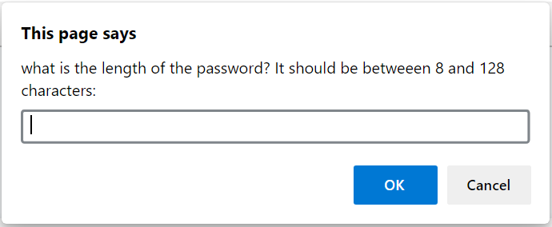
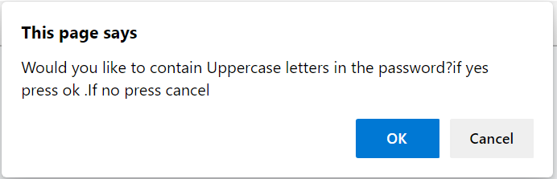
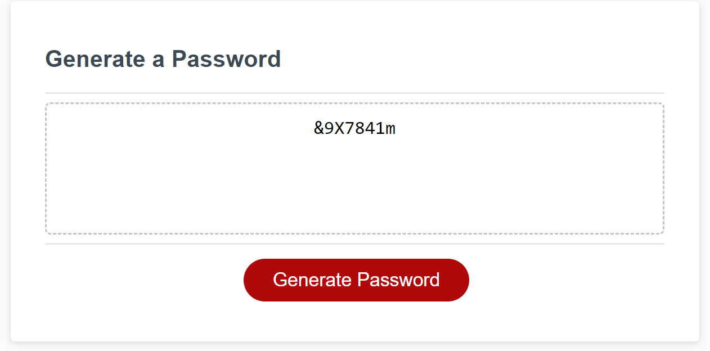

# passwordJenny
Generate a secure password according to user's criteria

# Deployed URL :
https://shaimaaGhamry/passwordJenny

# Functions and  screenshots:
 ## at the first, when the userd clicked on the "Generate password" button, the user is asked to provide the length of the required password

## The length is validated to be between 8 and 128 characters.

## If the length is validated properly, then the user will be prombted with many questions asking about if the password contains:
uppercase or lowercase or numbers or symboles

## Aftet that, the criteria that the user selected will be validated to be at least one criteria is selected

## After validating the user criteria and the length of the password, the generated password will be displayed 

# How the password is generated:
to generate the password, we should have 2 inputs which are:
array of the selected criteria
the length of password

Then we iterate on the length of the required password
For each iteration, we generated a random character and then add it the required password  
Finally we display the generated password.

How a random character is generated:
we generate a random index to select a random criteria 
Then according to the random criteria, we generate a random character from this random criteria

for example, if the random criteria is numbers criteria:
then we get a random number from (0) to (9) and retrun it as a random characted to be added to the generated password.

